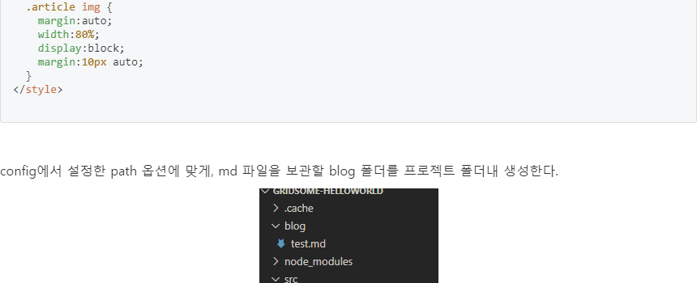
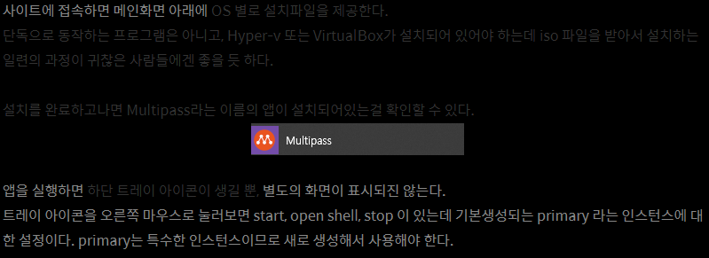

새로운 블로그를 오픈했습니다. 오예~ 😍

블로그를 새롭게 열었습니다. 생성 후 개발하면서 알아보았던 정보나 정리가 필요했던 지식을 보관하는 차원에서 잘 사용했던 티스토리였지만, 몇가지 단점(빡침)이 존재했었습니다.
몇가지를 나열해보자면,

## 한글 씹는 편집기

code 영역 바로 아래에 편집하려하면 한글이 입력 안됩니다. 이것때문에 매번 엔터 연타쳤다가 입력하거나, 한줄은 복사 붙여넣기로 입력한 뒤 마저 타이핑 했었죠 😡

한글 개무시하는 갓편집기

## 멋대로 생성되는 태그

아시는분들도 계시겠지만, 브라우저가 다크모드(Dark Mode)일 경우 배경색상과 일부 디자인을 다크모드에 맞게 변경될 수 있도록 적용했었습니다.
그런데 단점이 생기더군요. 글자 작성했다 몇번 편집하다보면 색상이 고정되어 버립니다! html 태그모드로 살펴보니 편집한 영역에 원치도 않는 태그가 붙으면서 색상을 적용했습니다. 처음엔 확인하며 없애다가 귀찮아져서 냅두게 되었습니다. 😅

지멋대로 정해지는 글자색상

## 컨텐츠 보관이슈

마지막으로, 언젠가 티스토리 자체가 운영중단된다면 제가 작성해두었던 컨텐츠를 보관하기가 난감해질 것도 같았습니다. 그래서 로컬에서도 보관하기 용이한 마크다운(Markdown) 방식의 블로그로 바꿔보고자 마음먹게 되었고, [Gridsome](https://gridsome.org)이라는 좋은 도구를 발견하여 실행에 옮기게 되었습니다.

맨땅에 헤딩하긴 너무 어려워 Gridsome 공식 Starter인 [gridsome-blog-starter](//gridsome.org/starters/gridsome-blog-starter/)를 약간 커스터마이징하였습니다. 기본제공하는 Starter는 Lighthouse 올백 맞던데 제가 건드리고나니까 점수가 팍 떨어지네요 (역시 똥손)

기존 블로그인 [ddochea.tistory.com](//ddochea.tistory.com)도 계속 운영할 예정입니다.
다만 UiPath RPA 시리즈처럼 연속적인 칼럼이 아닌 기록위주로 작성될 거 같네요.

기존의 컨텐츠들도 잘다듬어서 v2.0으로 옮겨오겠습니다. 😋