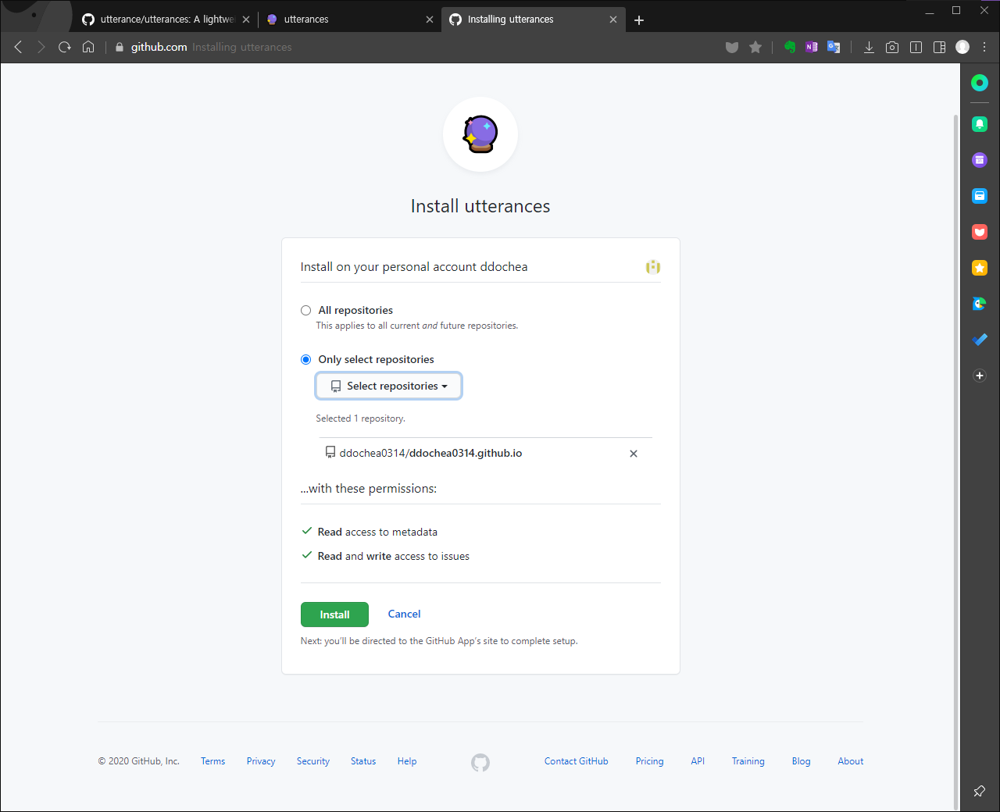
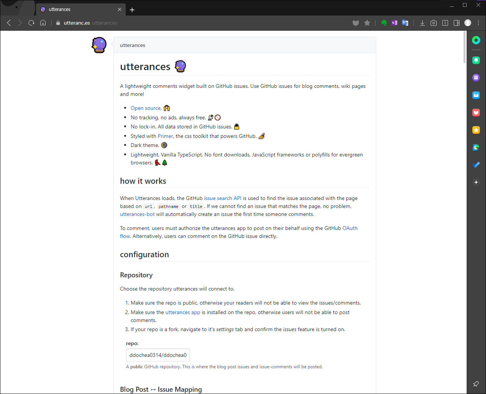
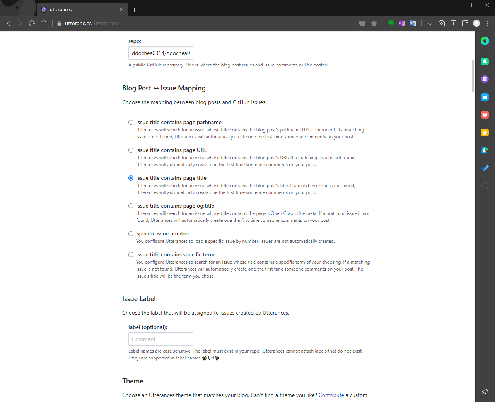
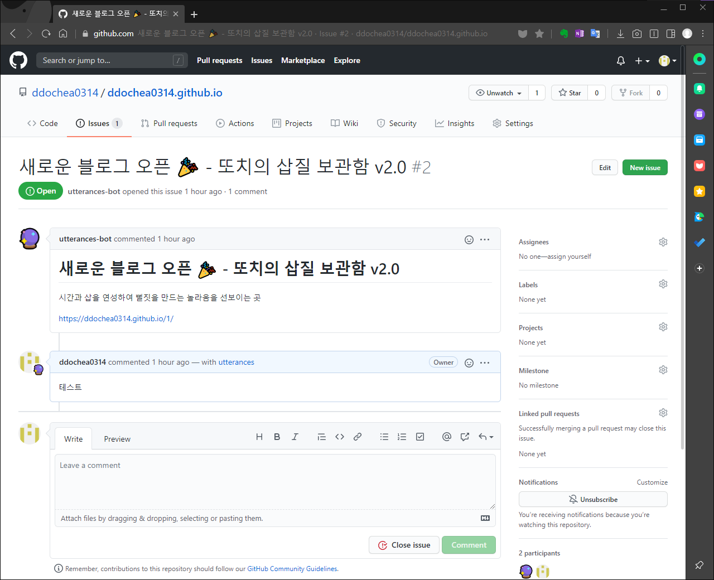
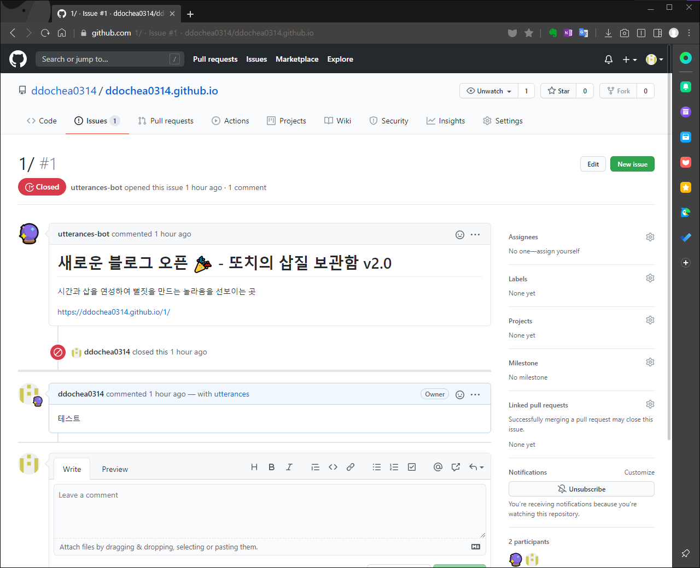
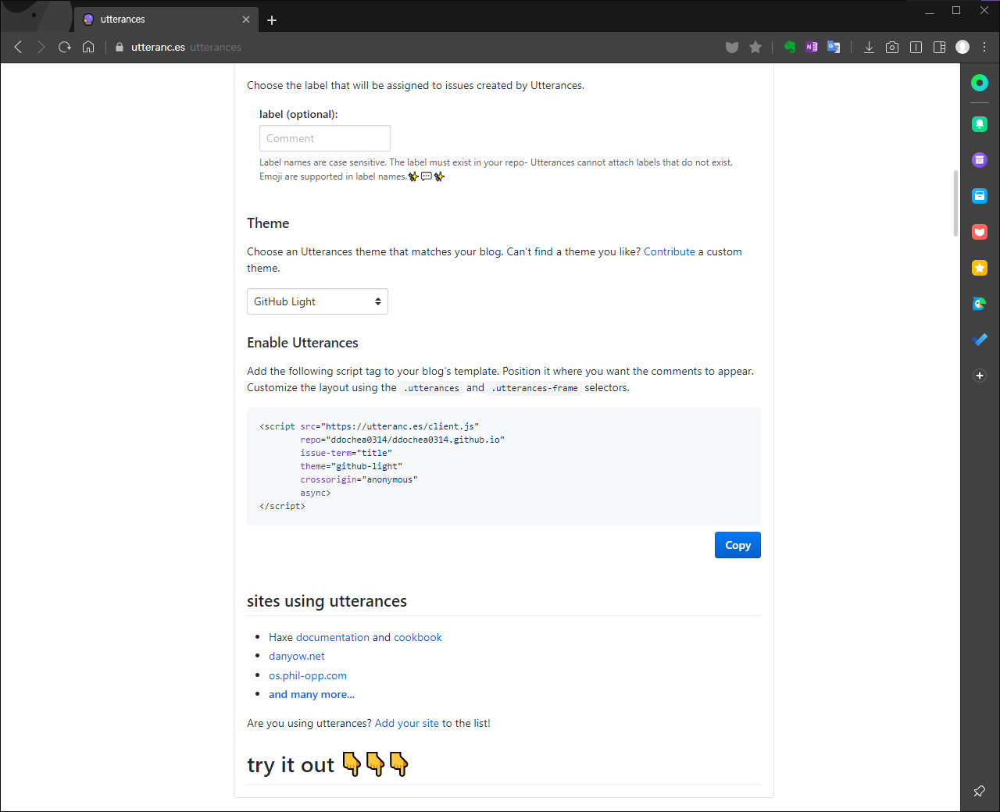
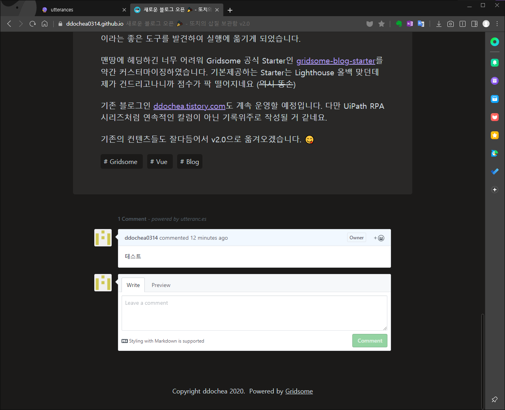

이제 댓글을 달 수 있습니다. utterances 라는 github issue API기반 오픈소스앱 덕분에 말이죠~ 👍

이번 시간엔 현재 블로그에 utterances 를 직접 적용한 경험을 바탕으로 Gridsome 기반의 블로그에 utterances 
적용하는 방법을 공유해보도록 하겠습니다. 

## 1. utterances 설치하기

운영중인 블로그 리포지토리에 utterances를 설치합니다.


<span class="img-title">utterances 설치하기</span>

설치가 완료되면 아래 이미지와 같이 설정 및 적용 Script 태그를 복사할 수 있는 사이트가 표시됩니다.

> 설치 후 https://utteranc.es/ 로 직접 이동해도 됩니다.


<span class="img-title">설치 후 이동하는 페이지</span>

## 2. 설정하기

설정에 필요한 필수적인 과정은 두 가지입니다. utterances를 사용할 리포지토리 설정과 이슈 매핑인데요. 사용할 리포지토리는 단순 리포지토리 이름만 입력하면 됩니다.

이슈 매핑도 어려운 부분은 없습니다. 포스트에 대한 댓글 생성시 이슈 제목을 어떤 유형으로 생성할 것인지를 선택하는 옵션입니다.


<span class="img-title">설정화면(?)</span>

<span class="line-through">제 경우는 **"Issue title contains page title"** 으로 선택했습니다. 해당 옵션으로 선택할 경우, 블로그의 리포지토리 이슈란에 포스트 제목 단위로 이슈가 생성됩니다.</span>

**Issue title contains page title** 로 설정할 경우, 다른 포스트의 댓글이 표시되는 현상을 확인되었습니다. 한글이라서 그런건지, 아니면 설정미스인건지 잘 모르겠네요. 😅 
그래서 직접 이슈제목을 생성할 수 있는 방식으로 최종 결정하였습니다. 옵션은 **Issue title contains specific term** 이지만, 굳이 선택하지 않으셔도 됩니다.


<span class="img-title">Issue title contains page title 설정 예시</span>

만약 **"Issue title contains page pathname"** 으로 선택할 경우 포스트의 URL 경로 중 하위 경로를 제목으로
생성하게 됩니다. 현재 제 블로그의 각 포스트는 숫자 ID 단위로 Path를 지정했기 때문에 [ddochea0314.github.io/1](/1/) 포스트에 댓글을 달면 아래와 같이 이슈가 생성됩니다.


<span class="img-title">Issue title contains page pathname 설정 예시</span>

두 가지 설정이 완료되면 사이트 아래쪽에 설정에 맞게 변환된 `<Script>`태그가 표시됩니다.


<span class="img-title">생성된 스크립트 태그</span>

그러나 이대로 사용할 순 없습니다. 템플릿을 이용한 Vue에선 `<Script>`태그를 그대로 붙여넣을 순 없으므로
다음 단계와 같은 코딩 작업이 필요합니다.

## 3. Post 템플릿에 utterances 코드 적용하기

제가 사용하는 [gridsome-blog-starter](https://gridsome.org/starters/gridsome-blog-starter/)에는 각 포스트에 대한 디자인 및 컨텐츠 표시를 담당하는 Post.vue 컴포넌트가 존재합니다. 
이 템플릿에는 댓글을 달 수 있는 공간인 `<div class="post-comments">` 가 제공되어 있습니다.
해당 태그를 아래와 같이 편집하세요.

```javascript
<div id="comments" class="post-comments">
  <!-- Add comment widgets here -->
</div>
```

그 뒤, `mounted()`를 생성하고 아래와 같이 코딩합니다.
```javascript
  mounted() {
    const script = window.document.createElement("script");
    const utterance = window.document.getElementById('comments');
    const attrs = {
      src : 'https://utteranc.es/client.js',
      repo : '[블로그 리포지토리]',
      "issue-term": `(${this.$page.post.date}) - ${this.$page.post.title}`, // 설정한 graphQL에 맞게 편집가능. 단, 포스트마다 고유한 값이 되도록 설정해야함.
      theme : "github-light",
      crossorigin: "anonymous",
      async : true
    }
    Object.entries(attrs).forEach(([key, value]) => {
      script.setAttribute(key, value);
    });
    utterance.appendChild(script);
  }
```

이제 `npm run develop` 명령을 실행해보세요. 포스트 하단에 댓글기능이 추가된 것을 확인할 수 있습니다.


<span class="img-title">작업완료 확인</span>

이것으로 댓글기능을 확인해보았습니다. 여러분도 댓글을 달고 보다 소통되는 사이트를 만들어보시기 바랍니다. 🤗