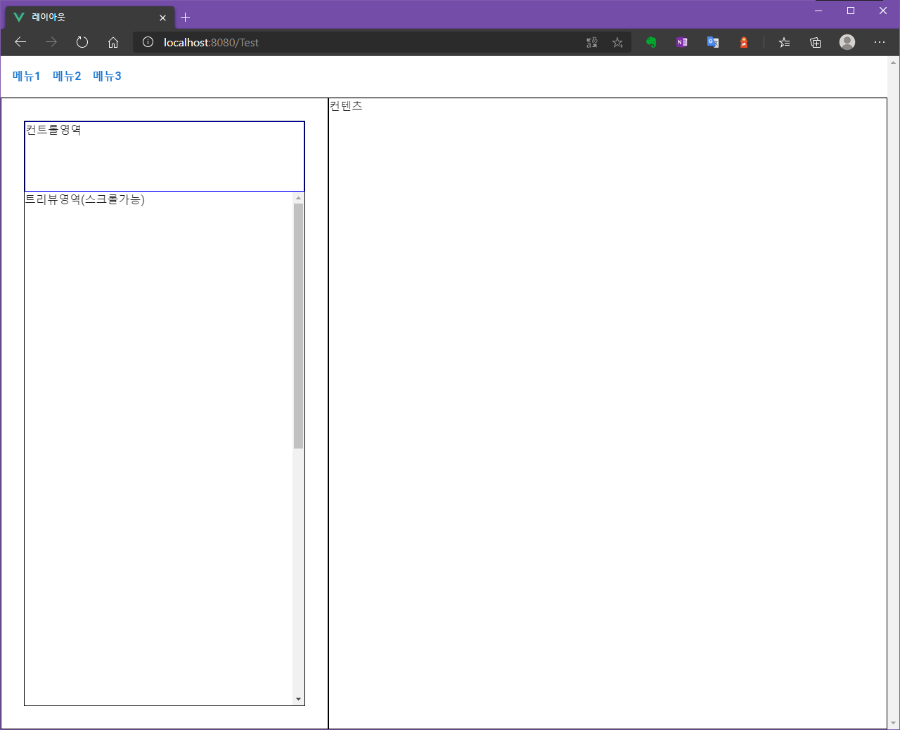
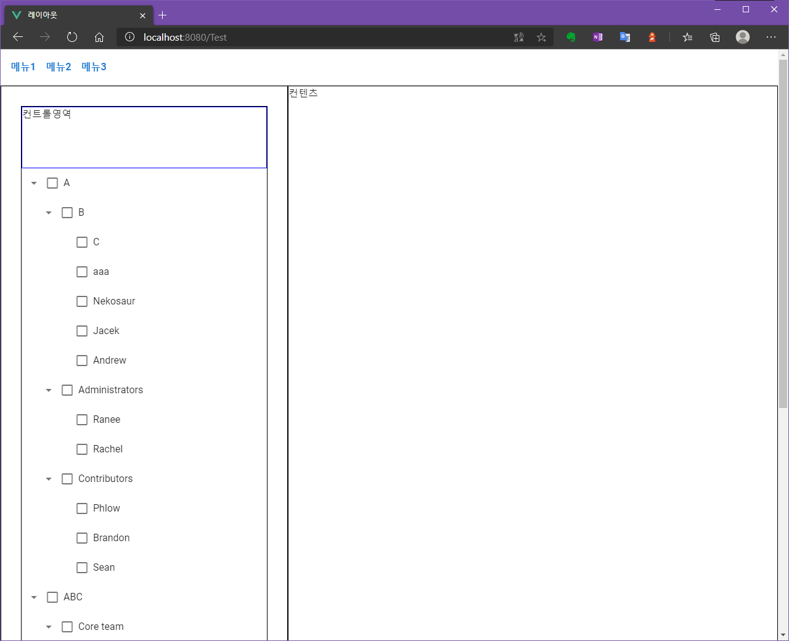
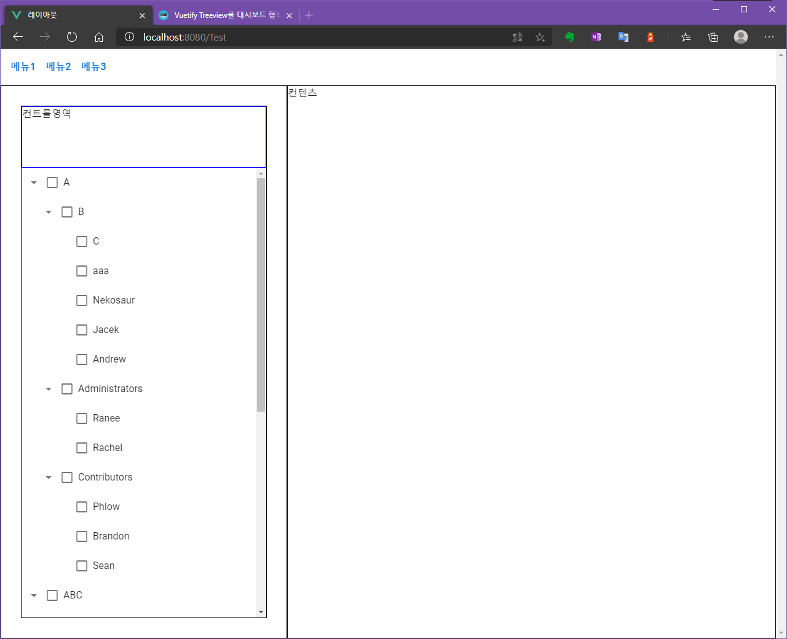

> 요약 : Treeview를 가변적인 크기의 특정 영역안에서 사용하고싶다면, 부모영역의 높이, 너비가 %만 존재하면 안된다. 부모노드 중 최소 한곳에서 vw, vh 사용할 것.

현재 사내에서 사용할 웹 기반 솔루션을 개발하고 있습니다. 개발초기라 본격적인 구현에 앞서 UI 레이아웃을 잡고 그 위에 Vuetify 기반의 컨트롤을 배치하고 있었습니다.
대략 아래와 같은 디자인으로 구성하려했죠.


<span class="img-title">원하는 바</span>

그런데 실제 컨트롤을 배치하고나니 다음과 같은 상황이 펼쳐졌습니다.


<span class="img-title">레이아웃 씹고 광할하게 펼쳐지시는 갓 트리뷰</span>

원인을 찾아보려했지만 어떤 옵션이 문제인건지 감이 잡히지 않더군요 🤔
scss로 디자인하기때문에 길이를 계산하여 넣어줄수도 있었겠지만 트리 상단부분도 가변적인 길이가 되기 때문에 난감하던차에 부모 태그에서 vw, vh로 영역을 잡았을때 정상적으로
`overflow`가 잡히는것을 확인하고 아래와 같이 해결하게 되었습니다.

```scss
//App.vue의 scss 템플릿에 아래와 같이 추가

.v-main {
  // 레이아웃에서 메뉴를 제외한 전체 영역 클래스명
  height:calc(100vh - 64px); // 64px는 상단 메뉴의 height길이
  width:100vw;
}
```

<span class="img-title">nailed it!</span>

제 경우에는 v-main이 메뉴를 제외한 모든 영역을 담당하며, 메뉴길이는 고정값이라 간단하게 몇줄 해결할 수 있었습니다. 비록 모든 분들께 도움될만한 정보는 아닐 수 있지만
혹여 헤메시는 분들이 계신다면 저처럼 해결해보시는것도 방법이 될 수 있으리라 기대합니다. 😅