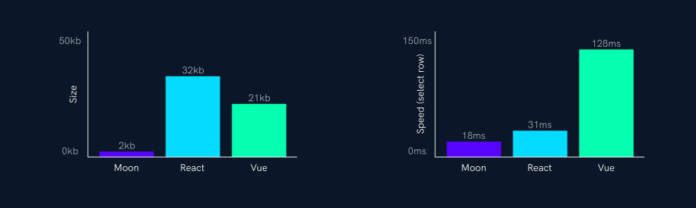
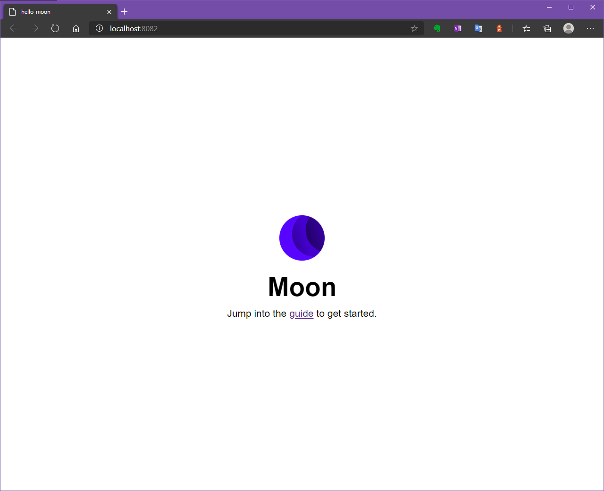
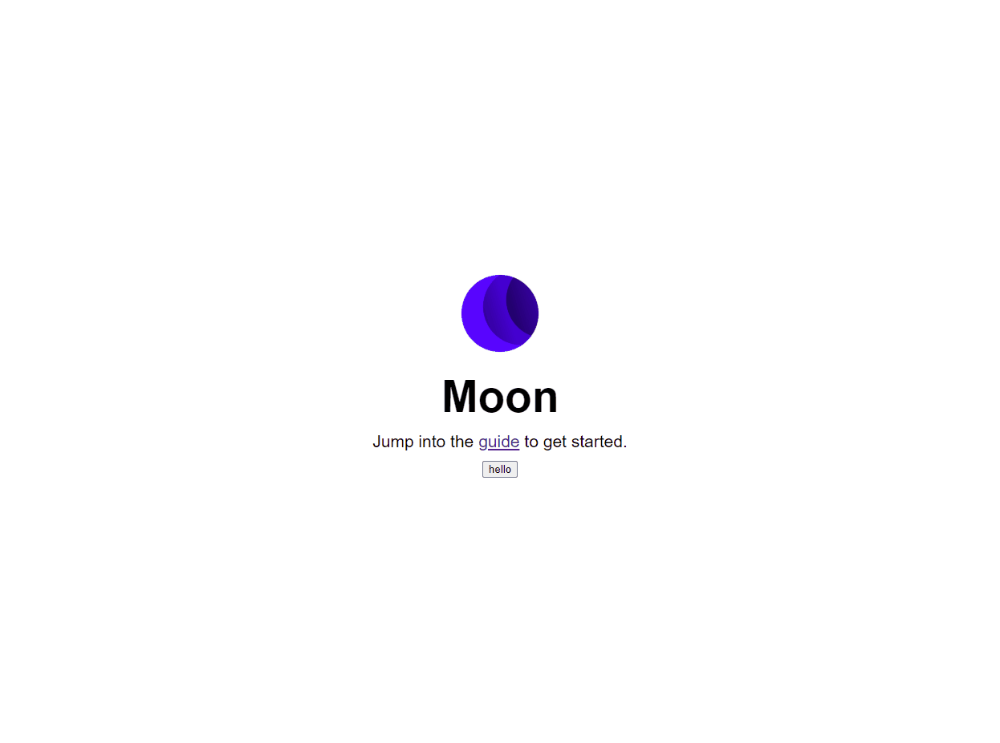

> 요약 : 이런게 있구나 정도.

현재 구독중인 Medium 에서 관심이 갈만한 프레임워크가 소개되었습니다. "Moon"이라 불리는 프레임워크인데요.
프론트엔트 라이브러리이므로 Vue, React등과 비교됩니다. 제가 본 원글은 아래 링크를 통해 들어가실 수 있습니다.

[blog.bitsrc.io introduction to Moon](https://blog.bitsrc.io/introduction-to-moon-js-c1526fcb543e)

라이브러리 공식사이트는 [https://moonjs.org/](https://moonjs.org/) 입니다. 링크를 들어가보면 메인화면 아랫쪽에 눈에 띌만한
그래프가 보입니다.


<span class="img-title">번들크기 및 속도 비교그래프</span>

원래 자기들이 만든 프레임워크가 가장 좋다고 하는 법이지만 실제 CLI를 생성하는 기본 템플릿 프로젝트를 빌드한 결과를 비교하면 용량차이가 어느정도 나는 건 사실이긴 합니다 😅

그럼 체험을 위해 직접 Moon을 설치하고, 기본템플릿을 통해 SPA를 생성해보겠습니다.

## 1. Moon CLI 설치 및 프로젝트 생성

cmd 에서 아래와 같이 명령어를 입력하세요.

```
npm install -g moon-cli
moon create {생성할 프로젝트명}
```

## 2. 패키지 설치
생성한 프로젝트 폴더로 이동한 뒤 `npm install` 명령을 입력하세요.

## 3. cross-env 설치

여러 개발환경에서도 NODE_ENV 를 제대로 사용할 수 있도록 cross-env를 설치해주세요.
개발자가 실수한 것인지 용량을 극단적(?)으로 줄여보고 싶었던건진 알 수 없지만, 해당작업이 없으면 Windows 환경에선 npm 명령이 오류납니다.

```
npm install --save-dev cross-env
```

## 4. package.json 편집
npm 명령어가 정상적으로 동작할 수 있도록 아래 두 명령어 `dev`와 `build`를 변경하세요.

```
"dev": "cross-env NODE_ENV=development webpack-dev-server --config webpack.config.js",
"build": "cross-env NODE_ENV=production webpack --config webpack.config.js"
```

## 5. 실행
생성한 프로젝트 폴더로 이동한 뒤 `npm run dev` 명령을 입력하세요. 정상적으로 동작한다면
webpack 개발서버 실행과 함께 결과물이 브라우저에 띄워집니다.


<span class="img-title">실행결과</span>

이대로 끝내기엔 아쉬우니 버튼 이벤트 정도하나만 추가해보겠습니다. 😅

## 6. src/view/home.js 에 버튼추가
실행을 종료시켜 주시고, 기본 생성된 프로젝트에서 src/view/home.js 로 이동해주세요. 1.0.0-beta.7 버전기준으로
아래와 같은 내용이 나올 것입니다.

```javascript
import Moon from "moon";
import moonLogo from "images/moon-logo.png";
const { div, img, h1, p, a } = Moon.view.m;

export default ({ data }) =>
	<div id="root" class="a-x-c a-y-l-c">
		<div class="s-x-25 a-x-c m-y-3">
			
			<h1 class="s-x-25 a-t-c">{data.name}</h1>
			<p class="s-x-25 a-t-c">Jump into the <a href="https://moonjs.org/guide" target="_blank">guide</a> to get started.</p>
		</div>
	</div>;
```

위 소스를 아래와 같이 바꿔주세요.

```javascript
import Moon from "moon";
import moonLogo from "images/moon-logo.png";
const { div, img, h1, p, a, button } = Moon.view.m; // button 추가

export default ({ data }) =>
	<div id="root" class="a-x-c a-y-l-c">
		<div class="s-x-25 a-x-c m-y-3">
			
			<h1 class="s-x-25 a-t-c">{data.name}</h1>
            <p class="s-x-25 a-t-c">Jump into the <a href="https://moonjs.org/guide" target="_blank">guide</a> to get started.</p>\
            <button>hello</button>
		</div>
    </div>;
```

## 7. 호출할 이벤트 함수 생성

소스 코드 맨 아래에 호출할 `function` 을 생성해주세요. 예시로 `alert`을 호출하는 `sayHello` 함수를 추가해보겠습니다.

```javascript
import Moon from "moon";
import moonLogo from "images/moon-logo.png";
const { div, img, h1, p, a, button } = Moon.view.m; // button 추가

export default ({ data }) =>
	<div id="root" class="a-x-c a-y-l-c">
		<div class="s-x-25 a-x-c m-y-3">
			
			<h1 class="s-x-25 a-t-c">{data.name}</h1>
            <p class="s-x-25 a-t-c">Jump into the <a href="https://moonjs.org/guide" target="_blank">guide</a> to get started.</p>\
            <button>hello</button>
		</div>
    </div>;

function sayHello({data}) {
	alert("hello "+ data.name) // main.js에서 넘어온 data를 바인딩
}
```
이제 실행해볼까요?


<span class="img-title">실행결과</span>

이것으로 Moon 프레임워크를 체험해보았습니다. 아직 Lint 지원이나 서드파티 프레임워크등이 없기 때문에 실제 프로젝트에 도입하기엔 아직 무리가 있겠지만
분명 매력적인 프레임워크이긴 합니다. 🙂

저도 시간이 된다면 Moon 프레임워크 기반으로 간략한 토이 프로젝트를 진행해봐야겠습니다.

> NOTE : 예제 소스는 https://github.com/ddochea0314/hello-moon 에 올렸습니다.