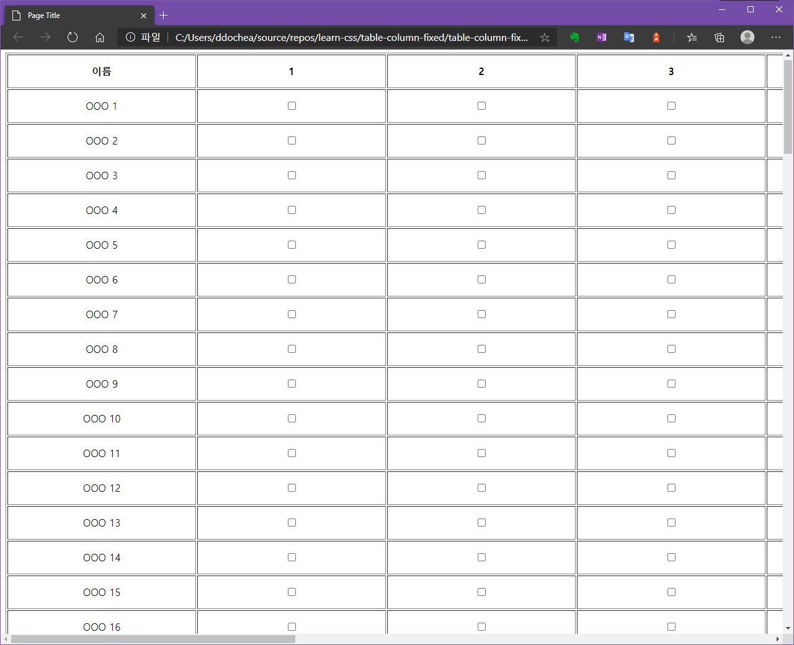
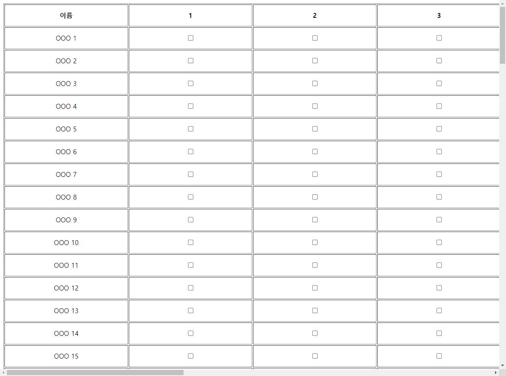

최근에 회사 내부에서 사용하는 솔루션을 위한 웹서비스 중 table 태그를 사용한 화면구성이 필요하여 만들게 되었었습니다. 어떤 화면인지 캡쳐는 할 수 없지만 대략 구성은 아래와 같습니다.


<span class="img-title">대략 이렇게 생겨먹은 레이아웃</span>

table의 각 td 내부에는 설정값에 대한 컨트롤이 포함되어 있었는데 사용하시던 직원분이 이런 문의를 주시더군요.

*"OO씨, 혹시 첫번째 열은 고정이 안될까요?*
<br />*오른쪽으로 스크롤하니 이름란이 안보여서 체크를 헷갈려요 ㅠㅠ"*

시간이 빠듯해서 겁나게 후려치듯(?) 만들다보니 생각못했던 부분이었습니다. -ㅅ- 다행히 해결방법은 간단했습니다.

```css
th:first-child,
td:first-child {
    position: sticky;
    background-color: white; /* 바탕을 불투명하게 처리해야 뒤로 숨은 다른 열들을 잘 가릴 수 있다 */
    left: 0;
    z-index: 99;
}
```


<span class="img-title">완성된 화면</span>

여러분들은 저처럼 헤메지 마시고 잘 해결하시기 바랍니다. 

> 전체 소스코드는 https://github.com/ddochea0314/learn-css 리포지토리 내 table-column-fixed 에서 찾아보실 수 있습니다.
> vue가 적용되어있지만 tr, td 태그를 반복 생성하기위해 사용했을 뿐 주제와는 무관합니다.