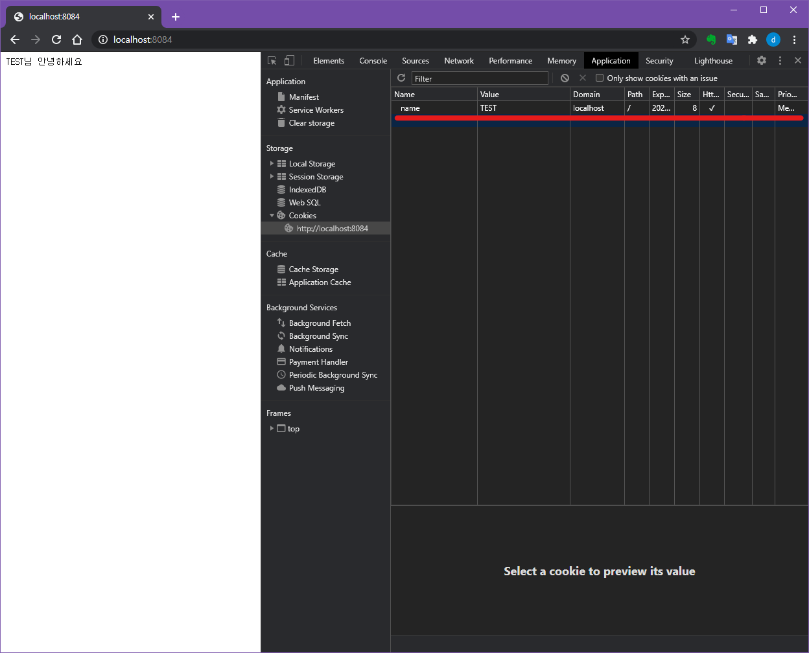

기본적인 로그인 기능이나 쇼핑몰에서 장바구니역할로 사용하는 Cookie는 `key=value` 값으로 구성되며, 세미콜론(;)으로 구분합니다.
서버에서 `Set-Cookie` 헤더를 통해 생성할 수 있으며, 한글과 줄바꿈이 들어가게 될 경우 URLEncoding이 필요합니다.
쿠키는 아래와 같은 옵션이 있으며, 브라우저에서의 개발툴에서도 확인가능합니다.

> 개발툴은 크롬, 파이어폭스등 잘 알려진 브라우저에서 F12를 기본 단축키로 쓰고 있습니다.

쿠키 확인 위치

## 1. Expires

쿠키의 만료기한을 설정합니다. 이 기한이 지나면 쿠키가 브라우저에서 제거됩니다. 아무 설정이 없으면, 쿠키의 만료시점은 브라우저 종료직후가 됩니다.

> 브라우저의 모든 탭이 종료되어야 사라집니다.

예시) Expires=Sun, 27 Sep 2020 03:43:23 GMT

## 2. Max-age

Expires와 동일하나, 날짜가 아닌 초단위로 설정합니다. 만약 Expires와 같이 설정될 경우, Max-age값을 따릅니다.

예시) Max-age=60

## 3. Domain

쿠키가 전송될 도메인입니다. 기본값은 현재 도메인입니다.

## 4. Path

쿠키가 전송될 URL입니다. 기본값 `/`이 아닌 특정 URL을 입력하면 해당 URL에서만 사용가능합니다.

예시) Path=/

## 5. Secure

https로 접속했을 때만 사용할 수 있도록 설정합니다.

## 6. HttpOnly

자바스크립트에선 쿠키를 사용할 수 없도록 설정합니다.