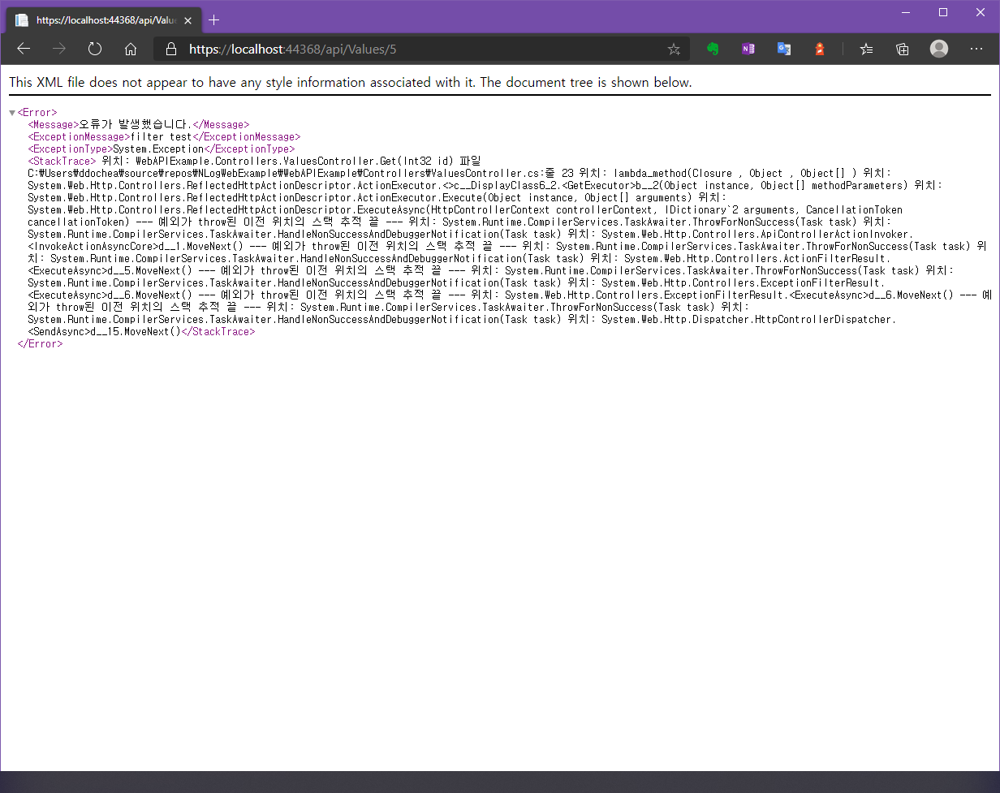

> ASP.NET Core 아닙니다. 회사가 보수적이라 아직도 .NET Framework입니다. .NET5도 나오는 마당에... <br />
> Core 마렵네요.

회사에서 업무 부서를 위한 웹 기반 자체솔루션을 개발중에 있습니다. 자주 다른 업무를 병행하면서 프로젝트를 진행하고 있어
기능 구현에 치중하다가 핵심기능이 어느정도 완료된 시점이라 Log를 적용시켜야겠다는 생각이 들더군요. 그래서 콘솔과 폼(Form)기반 프로그램
개발 때 애용하던 **NLog**를 적용해보았습니다.

이전에는 Log가 필요한 위치마다 Log Function을 호출해 기록 했었습니다. 딱히 문제되는건 아니었지만 2가지가 걸렸습니다.

- 모든 Request를 일일히 만들지 않아도 기록하고 싶다.
- 예상치 못한 Exception도 기록하고 싶다.

이 두 가지를 해결하기위한 방식으로 구현하고 이를 기록하고자 포스트를 쓰게 되었습니다.

## NLog가 무엇인가요?

**"NLog는 .NET 표준을 포함한 다양한 .NET 플랫폼을 위한 유연하고 무료 로깅 플랫폼입니다. NLog를 사용하면 여러 대상에 쉽게 쓸 수 있습니다. (데이터베이스, 파일, 콘솔) 로깅 구성을 즉시 변경합니다."**
라고 공식 사이트에 쓰여있습니다. 😅 Console, WinForm, WPF, ASP.NET 등등 .NET 으로 구성된 대부분의 플랫폼에서 간단하게 사용할 수 있다는 장점이 있습니다.

NLog외에도 로깅 라이브러리로는 log4Net이 있지만, 전 개인적으로 NLog를 추천드리고 싶습니다. 왜냐고요? 매우 간단하기 때문이죠! 😋
지금부터 ASP.NET 프로젝트에 차근차근 적용해 보겠습니다.

> 설명은 ASP.NET WebAPI 위주로 설명하였지만, MVC도 큰 차이 없습니다. WebForm은 다루지 않습니다.

## 모든 Request 기록하기

우선 두 가지 주제 중 첫번째인 **"모든 Request를 일일히 만들지 않아도 기록하고 싶다."** 를 해결해보겠습니다. 아래 순서대로 따라해보세요.

### 1. NLog 설치

Nuget에서 `NLog`, `NLog.Config`, `NLog.Schema`, `NLog.Web` 4가지 패키지를 설치해주세요. 각 패키지는 다음과 같은 목적으로 설치합니다.

> `NLog.Config`와 `NLog.Web`만 설치해줘도 나머지 2개의 패키지가 필요한 버전에 맞게 자동 설치됩니다.

- NLog : 핵심 기능인 NLog 패키지 입니다. 실질적으로 Log를 기록합니다.
- NLog.Config : 설치시 NLog의 설정값인 템플릿 및 로그 생성 유형(console, txt, db)를 정의하는 **NLog.config** 파일을 생성해줍니다.
Code로 직접 설정하거나, Web.Config에 작성하고 싶을 경우에는 설치하지 않으셔도 되지만, `ctrl`+`space`키 신공(?)으로 얻을 수 있는 intelliSense의 압도적인 편리함을 포기하고 싶지 않으시다면,
NLog.Config를 사용하는걸 추천드립니다. 🤗
- NLog.Schema : NLog.xsd 파일을 생성해줍니다. NLog.xsd 는 NLog.Config 파일을 구성하는 XML 스키마를 정의하는 파일입니다. 직접적으로 사용할 일은 거의 없지만, 삭제되거나 찾을 수 없는 상태가 되면 intelliSense를 사용할 수 없게됩니다.
- NLog.Web : 템플릿 의 `<target>`에 Web용에 맞춘 `Layout renderers`를 추가적으로 사용할 수 있습니다.

NLog를 처음 사용하시는 분들이라면 `<target>`, `Layout renderers`란 용어가 생소할 수 있는데 과정을 수행하다보면 자연스럽게 익히실 수 있으실 것 입니다.
(사실 자주 써도 용어는 생소해요)

### 2. NLog.Config 수정

NLog.Config를 열고 아래와 같이 작성해주세요.

```xml
<?xml version="1.0" encoding="utf-8" ?>
<nlog xmlns="http://www.nlog-project.org/schemas/NLog.xsd"
      xmlns:xsi="http://www.w3.org/2001/XMLSchema-instance"
      xsi:schemaLocation="http://www.nlog-project.org/schemas/NLog.xsd NLog.xsd"
      autoReload="true"
      throwExceptions="false"
      internalLogLevel="Off" internalLogFile="c:\temp\nlog-internal.log">

  <!-- optional, add some variables
  https://github.com/nlog/NLog/wiki/Configuration-file#variables
  -->
  <variable name="myvar" value="myvalue"/>

  <!--
  See https://github.com/nlog/nlog/wiki/Configuration-file
  for information on customizing logging rules and outputs.
   -->
  <targets>

    <!--
    add your targets here
    See https://github.com/nlog/NLog/wiki/Targets for possible targets.
    See https://github.com/nlog/NLog/wiki/Layout-Renderers for the possible layout renderers.
    -->
    <target xsi:type="File" name="logFile" fileName="${basedir}/logs/log_${shortdate}.log"
            layout="date: ${longdate}${newline}
            level: ${level}${newline}
            aspnet-request-url: ${aspnet-request-url}${newline}
            aspnet-request-method: ${aspnet-request-method}${newline}
            aspnet-request-contenttype: ${aspnet-request-contenttype}${newline}
            aspnet-response-statuscode: ${aspnet-response-statuscode}${newline}
            message: ${message}${newline}"
            archiveEvery="Day"
            concurrentWrites="true"
            maxArchiveFiles="30" />
    <!--
    Write events to a file with the date in the filename.
    <target xsi:type="File" name="f" fileName="${basedir}/logs/${shortdate}.log"
            layout="${longdate} ${uppercase:${level}} ${message}" />
    -->
  </targets>

  <rules>
    <!-- add your logging rules here -->
    <logger name="*" writeTo="logFile" />
    <!--
    Write all events with minimal level of Debug (So Debug, Info, Warn, Error and Fatal, but not Trace)  to "f"
    <logger name="*" minlevel="Debug" writeTo="f" />
    -->
  </rules>
</nlog>
```

Config 파일을 살펴보시면 ${}로 묶인 글자들이 눈에 띄실 겁니다. NLog에선 이것을 `Layout renderers`라고 합니다. `${basedir}`은 실행 프로세스의 경로, `${longdate}`는 기록시간,
`${level}`은 로그 레벨(Trace, Info, Warning, Error, Fatal)를 의미하며, aspnet으로 시작하는 renderer는 NLog.Web 을 설치해야 사용할 수 있습니다.

보다 자세한 정보는 [https://nlog-project.org/config/?tab=layout-renderers](https://nlog-project.org/config/?tab=layout-renderers)에서 확인할 수 있습니다.

### 3. Web.Config에 Module 추가

console이나 Windows 클래식 어플리케이션 개발과 달리, ASP.NET에선 해당 패키지를 사용할 수 있도록 web.config를 수정해야 합니다. `<system.webServer>` 태그 내부에 아래 태그를 추가해주세요.

```xml
<modules runAllManagedModulesForAllRequests="true">
    <add name="NLog" type="NLog.Web.NLogHttpModule, NLog.Web" />
</modules>
```

### 4. Global.asax.cs 수정

Global.asax.cs 파일을 연 뒤, WebApiApplication 클래스에 아래와 같은 `static` 객체를 선언해주세요.

```cs
public class WebApiApplication : System.Web.HttpApplication
    {
        private static NLog.Logger logger;

        '''이하생략'''
    }
```

 Application_Start() 함수 내 `NLog.Web.NLogHttpModule.BeginRequest += NLogHttpModule_BeginRequest`를 추가해주세요.

```cs
protected void Application_Start()
        {
            logger = NLog.LogManager.GetCurrentClassLogger(); // 로거 생성
            AreaRegistration.RegisterAllAreas();
            GlobalConfiguration.Configure(WebApiConfig.Register);
            FilterConfig.RegisterGlobalFilters(GlobalFilters.Filters);
            RouteConfig.RegisterRoutes(RouteTable.Routes);
            BundleConfig.RegisterBundles(BundleTable.Bundles);
            NLog.Web.NLogHttpModule.BeginRequest += NLogHttpModule_BeginRequest; // 이벤트 추가
        }
```

이벤트 함수인 `NLogHttpModule_BeginRequest()` 는 아래와 같이 구현해주세요. 

> 예시에는 sender를 Info의 파라메터로 담았는데, 큰 의미는 없습니다. 단순 텍스트형식의 메시지를 입력하거나, sender의 값을 적절히 사용하시면 됩니다.

```cs
private void NLogHttpModule_BeginRequest(object sender, EventArgs e)
{
    var app = sender as WebApiApplication;
    logger.Info(app);
}
```

`NLog.Web.NLogHttpModule` 에는 `BeginRequest`외 `EndRequest`라는 이벤트도 존재합니다. 둘다 요청(Request)발생 때 실행하는 이벤트지만
이름처럼 `BeginRequest`는 요청 발생시작시점에서, `EndRequest`는 작업 후 응답(Response) 전에 발생하는 차이가 있습니다.

이것으로 두 가지 중 첫번째인 **"모든 Request를 일일히 만들지 않아도 기록하고 싶다."** 를 해결해보았습니다.


## 처리하지 않은 Exception 기록하기

두 가지 주제 중 나머지  **"예상치 못한 Exception도 기록하고 싶다."** 를 해결해보겠습니다. 앞서 진행한 순서 중 4번째를 제외하곤 모두
동일한 단계를 거치므로 이어서 진행하셔도 됩니다.

### 1. Filter 추가하기

프로젝트내 Filters 폴더를 추가하고, 아래와 같이 클래스를 구현해주세요.

> .NET의 기능중 하나인 특성(Attribute) 사용해야 하므로, 클래스의 이름은 반드시 Attribute로 끝나야 합니다.
> 보다 자세한 사항은 [https://docs.microsoft.com/ko-kr/dotnet/csharp/tutorials/attributes](https://docs.microsoft.com/ko-kr/dotnet/csharp/tutorials/attributes) 를 참조해주세요.

> 프로젝트의 다른 구성요소와 구분하기위해 Filters 폴더를 추가하여 생성할 뿐, 반드시 폴더명이 Filters일 필요는 없습니다.

```cs
using System;
using System.Collections.Generic;
using System.Linq;
using System.Threading;
using System.Threading.Tasks;
using System.Web;
using System.Web.Http.Filters;

namespace BrandDBWebService.Filters
{
    /// <summary>
    /// 관리되지 않는 예외를 기록하기위한 Attribute입니다. try catch를 통해 처리된 예외는 기록하지 않습니다.
    /// </summary>
    public class LogErrorsAttribute : FilterAttribute, IExceptionFilter
    {
        public async Task ExecuteExceptionFilterAsync(HttpActionExecutedContext actionExecutedContext, CancellationToken cancellationToken)
        {
            var action = actionExecutedContext;
            await Task.Run(() =>
            {
                var logger = NLog.LogManager.GetCurrentClassLogger();
                logger.Error(action.Exception);
            });
        }
    }
}
```

2. Filter 적용하기
Controller에 `LogErrors` 특성을 적용합니다.

```cs
[LogErrors]
public class ValuesController : ApiController
{
    // GET api/values
    public IEnumerable<string> Get()
    {
        return new string[] { "value1", "value2" };
    }

    // GET api/values/5
    public string Get(int id)
    {
        return "value";
    }

    // POST api/values
    public void Post([FromBody] string value)
    {
    }

    // PUT api/values/5
    public void Put(int id, [FromBody] string value)
    {
    }

    // DELETE api/values/5
    public void Delete(int id)
    {
    }
}
```

이것으로 적용이 완료되었습니다. 확인을 위해 `Get(int id)`를 아래와 같이 편집하세요.

```cs
// GET api/values/5
public string Get(int id)
{
    throw new Exception("filter test");
    return "value";
}
```

## 테스트

두 가지 모두 적용되었는지 확인해보겠습니다. F5를 눌러 디버그로 실행해보세요. 사이트가 정상적으로 실행된다면
프로젝트 폴더내 logs 라는 폴더가 생성되며, 일자로 기록된 로그파일 내 모든 Request가 NLog.config의 `<target>` layout에 따라 생성된 것을 확인할 수 있습니다.

```txt
date: 2020-10-06 00:39:39.9316
             level: Info
             aspnet-request-url: https://localhost/
             aspnet-request-method: GET
             aspnet-request-contenttype: 
             aspnet-response-statuscode: 200
             message: ASP.global_asax

date: 2020-10-06 00:39:42.2735
             level: Info
             aspnet-request-url: https://localhost/Scripts/jquery-3.4.1.js
             aspnet-request-method: GET
             aspnet-request-contenttype: 
             aspnet-response-statuscode: 200
             message: ASP.global_asax

date: 2020-10-06 00:39:42.2735
             level: Info
             aspnet-request-url: https://localhost/Content/bootstrap.css
             aspnet-request-method: GET
             aspnet-request-contenttype: 
             aspnet-response-statuscode: 200
             message: ASP.global_asax

date: 2020-10-06 00:39:42.2755
             level: Info
             aspnet-request-url: https://localhost/Scripts/bootstrap.js
             aspnet-request-method: GET
             aspnet-request-contenttype: 
             aspnet-response-statuscode: 200
             message: ASP.global_asax

date: 2020-10-06 00:39:42.2755
             level: Info
             aspnet-request-url: https://localhost/Content/site.css
             aspnet-request-method: GET
             aspnet-request-contenttype: 
             aspnet-response-statuscode: 200
             message: ASP.global_asax

date: 2020-10-06 00:39:42.2755
             level: Info
             aspnet-request-url: https://localhost/Scripts/modernizr-2.8.3.js
             aspnet-request-method: GET
             aspnet-request-contenttype: 
             aspnet-response-statuscode: 200
             message: ASP.global_asax

date: 2020-10-06 00:39:42.6485
             level: Info
             aspnet-request-url: https://localhost/favicon.ico
             aspnet-request-method: GET
             aspnet-request-contenttype: 
             aspnet-response-statuscode: 200
             message: ASP.global_asax
```

이제 Exception을 테스트해보겠습니다. URL에 https://localhost:{포트번호}/api/Values/5 를 입력해보세요.


<span class="img-title">throw에 의해 유발된 오류</span>

확인을 위해 로그파일을 다시 열어봅니다.

```
date: 2020-10-06 00:52:13.1822
             level: Error
             aspnet-request-url: 
             aspnet-request-method: 
             aspnet-request-contenttype: 
             aspnet-response-statuscode: 
             message: System.Exception: filter test
   위치: WebAPIExample.Controllers.ValuesController.Get(Int32 id) 파일 C:\Users\ddochea\source\repos\NLogWebExample\WebAPIExample\Controllers\ValuesController.cs:줄 23
   위치: lambda_method(Closure , Object , Object[] )
   위치: System.Web.Http.Controllers.ReflectedHttpActionDescriptor.ActionExecutor.<>c__DisplayClass6_2.<GetExecutor>b__2(Object instance, Object[] methodParameters)
   위치: System.Web.Http.Controllers.ReflectedHttpActionDescriptor.ActionExecutor.Execute(Object instance, Object[] arguments)
   위치: System.Web.Http.Controllers.ReflectedHttpActionDescriptor.ExecuteAsync(HttpControllerContext controllerContext, IDictionary`2 arguments, CancellationToken cancellationToken)
--- 예외가 throw된 이전 위치의 스택 추적 끝 ---
   위치: System.Runtime.CompilerServices.TaskAwaiter.ThrowForNonSuccess(Task task)
   위치: System.Runtime.CompilerServices.TaskAwaiter.HandleNonSuccessAndDebuggerNotification(Task task)
   위치: System.Web.Http.Controllers.ApiControllerActionInvoker.<InvokeActionAsyncCore>d__1.MoveNext()
--- 예외가 throw된 이전 위치의 스택 추적 끝 ---
   위치: System.Runtime.CompilerServices.TaskAwaiter.ThrowForNonSuccess(Task task)
   위치: System.Runtime.CompilerServices.TaskAwaiter.HandleNonSuccessAndDebuggerNotification(Task task)
   위치: System.Web.Http.Controllers.ActionFilterResult.<ExecuteAsync>d__5.MoveNext()
--- 예외가 throw된 이전 위치의 스택 추적 끝 ---
   위치: System.Runtime.CompilerServices.TaskAwaiter.ThrowForNonSuccess(Task task)
   위치: System.Runtime.CompilerServices.TaskAwaiter.HandleNonSuccessAndDebuggerNotification(Task task)
   위치: System.Web.Http.Controllers.ExceptionFilterResult.<ExecuteAsync>d__6.MoveNext()
```

Info와 달리, aspnet 관련 로그가 표시되진 않지만 stacktrace로 인해 소스의 오류위치는 파악할 수 있습니다.

이것으로 ASP.NET에 NLog를 적용해보는 시간을 가져보았습니다.