> 해당 포스트에는 Docker에 대한 개념을 설명하지 않습니다.
> Docker에 대한 개념 및 실습은 [https://www.44bits.io](https://www.44bits.io/ko/post/almost-perfect-development-environment-with-docker-and-docker-compose)를 참고해주시기 바랍니다.

> 해당 포스트는 개발환경 PC에 로컬로 구축된 Docker에서 진행하는 개발환경 구축입니다.

vscode 에는 Microsoft에서 제공하는 Docker 확장기능을 제공합니다. 처음에는 그저 dockerfile과 docker-compose 파일에 대한 intellisense를 제공하는 정도로만
생각했었는데, Docker 기반의 개발환경을 손쉽게 구성하는 방법도 있어 기록하게 되었습니다.

## 1. 도커 확장설치

VSCode 에서 Docker 확장을 설치합니다.

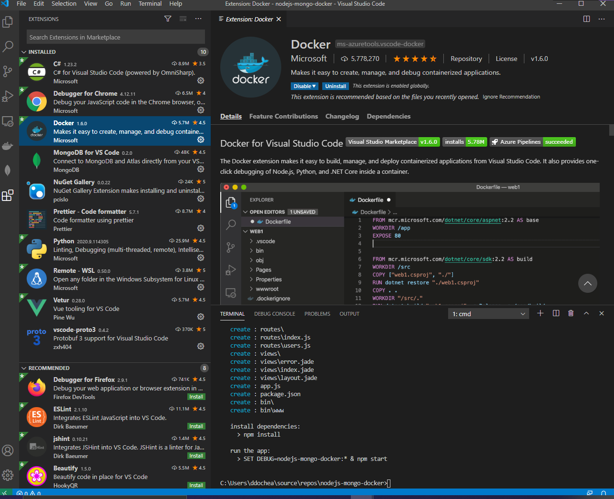
vscode docker 확장 설치

## 2. 프로젝트 생성

express 기반의 프로젝트를 하나 만들겠습니다. `docker-express-dev` 폴더를 하나 생성한 뒤, `express` 명령어로 express 파일을 생성합니다.

> express 명령어는 `npm install express-generator -g` 로 설치하면 사용할 수 있습니다.

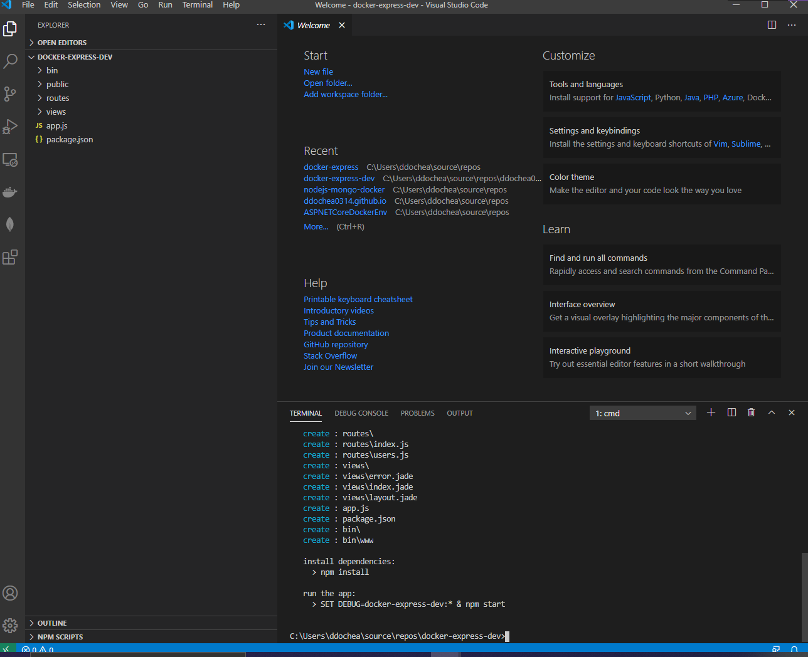

express 프로젝트 생성

## 3. Command Palette 호출

VSCode의 하단 설정화면 또는 `ctrl + shift + p` 단축키(기본값)를 눌러 Command Palette를 호출합니다.

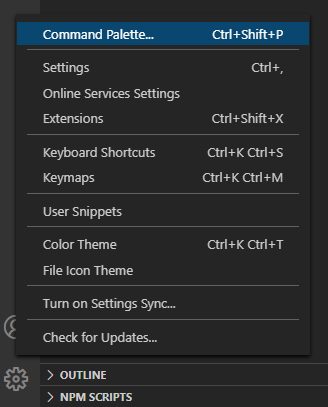
Command Palette 호출

## 4. Docker: Add Docker Files To Workspace 선택

커맨드 창에서 `Docker: Add Docker Files To Workspace`를 선택합니다.

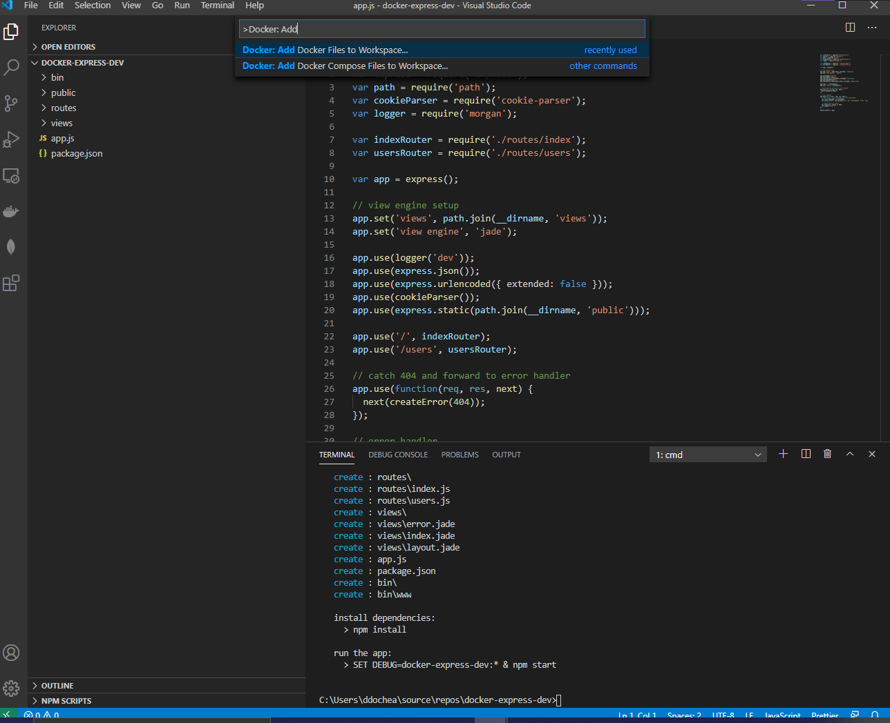
Add Docker Files To Workspace 선택

## 5. 개발 플랫폼 선택

개발플랫폼 선택에 `NodeJS`를 선택합니다.

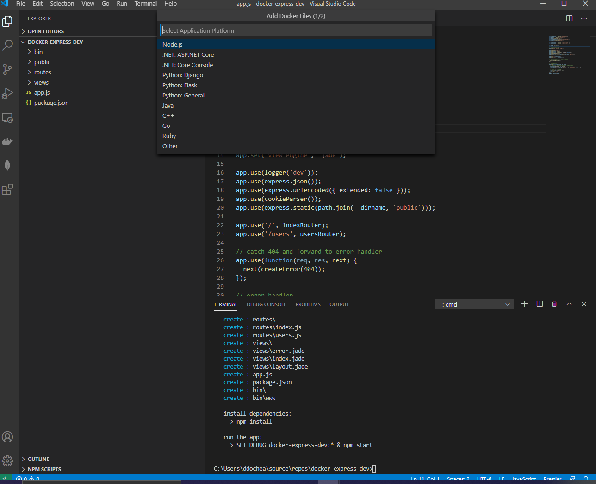
개발플랫폼 선택

## 6. 개발 플랫폼 선택

포트번호는 기본값으로 3000입니다. 생성되는 DockerFiles 및 compose 파일에서 언제든 바꿀 수 있으므로 그냥 선택 하셔도 됩니다.

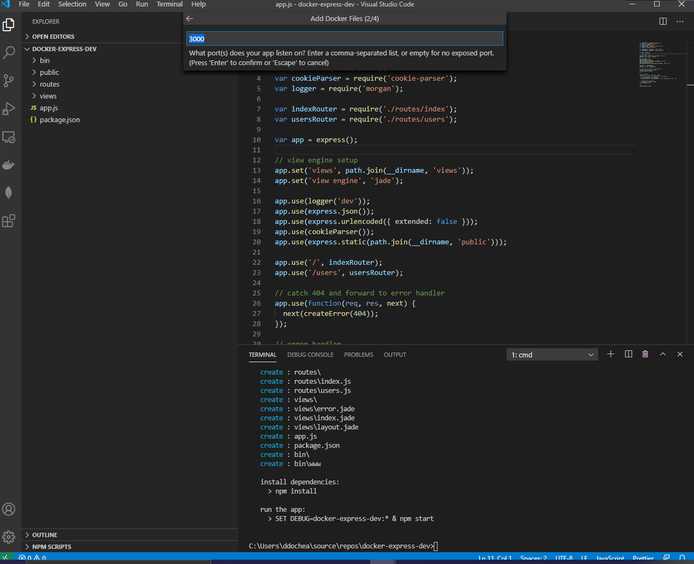
포트번호 선택

## 7. docker-compose 파일 생성여부 

docker-compose 파일도 생성할지 여부를 선택합니다. Dockerfile만으로도 디버깅은 가능하지만, 이번 시간에는 compose로 생성된 컨테이너에 Attach 하는방식으로 개발을
진행하기위해 생성(yes)를 선택해주세요.

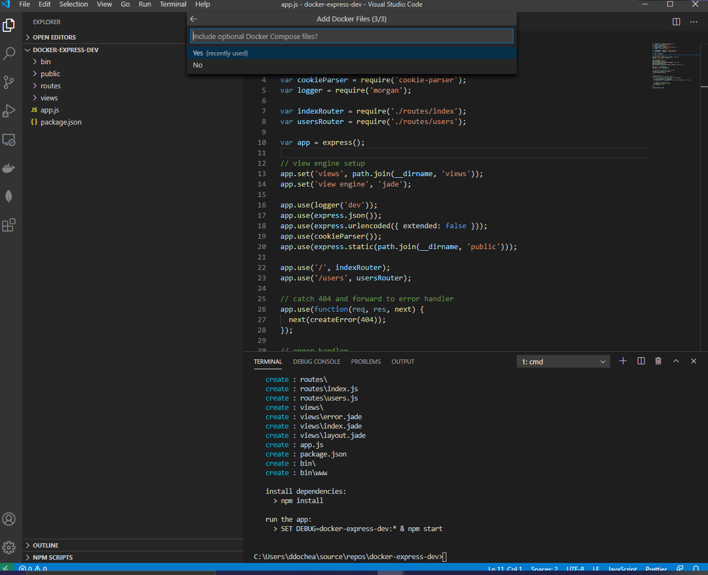
docker-compose 생성

생성이 완료되면 프로젝트 폴더안에 docker 관련 파일들이 자동생성된 것을 확인할 수 있습니다.

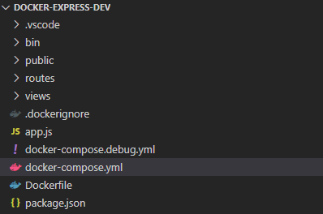
자동 생성된 도커파일

## 8. Compose up 실행

Docker-compose.debug.yml을 열고, 마우스 오른쪽 버튼을 누르세요. 그럼 하단의 Terminal 창에서 image 생성 및 Container 생성 작업이 표시됩니다.
작업이 완료되면 `Terminal will be reused by tasks, press any key to close it`이 표시됩니다.

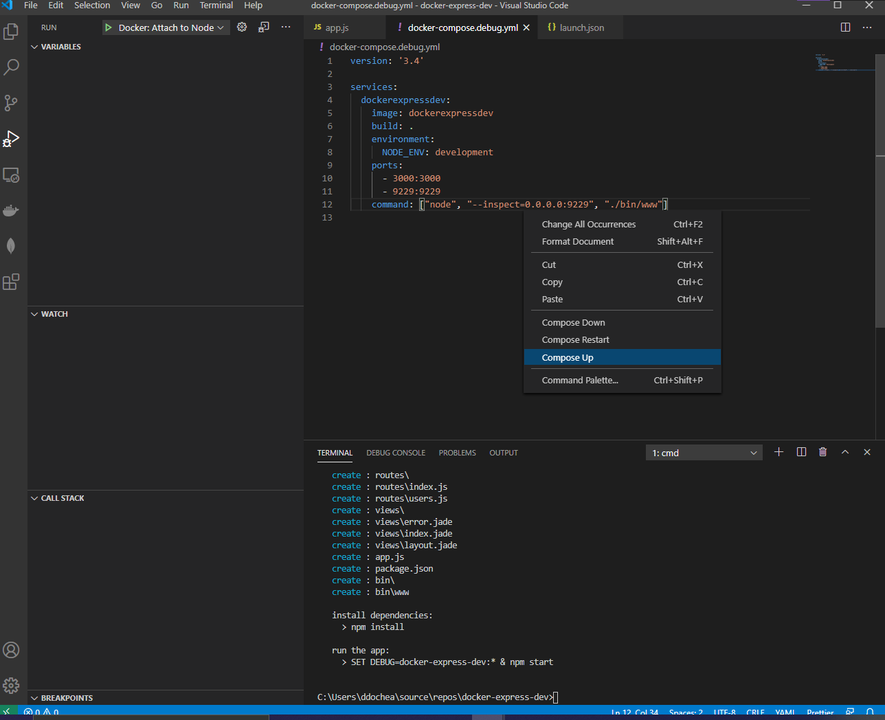
Compose up

## 9. 컨테이너 실행여부 확인

터미널에서 `docker ps` 명령어 또는 Docker Desktop에서 Container가 실행중인지 확인합니다.

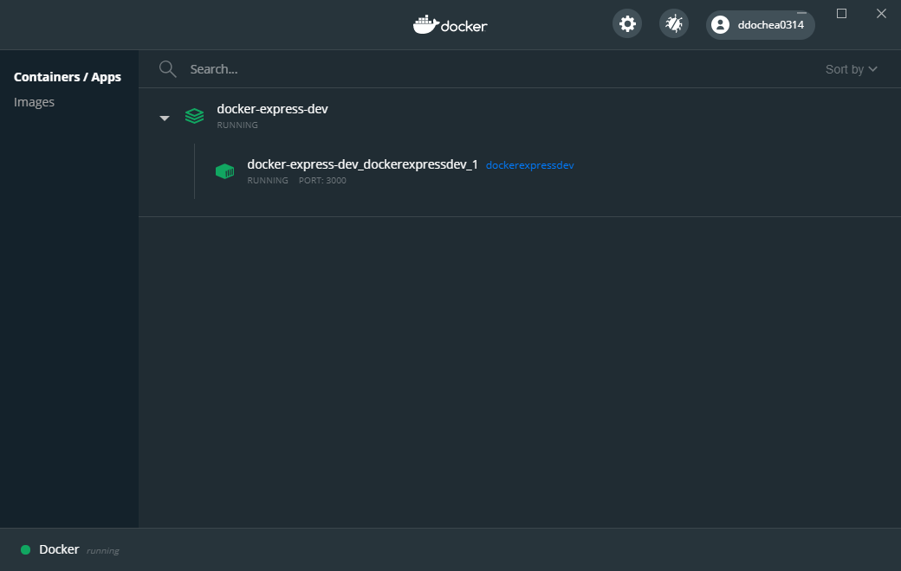
Container 실행여부 확인 (Windows)

## 10. launch.json 편집

실행중인 컨테이너에 연결(Attach)해 Debuging 하는 방식이므로 launch 방식을 수정해야합니다. `Add Configuration` 을 누른 뒤, `Docker: Attach to Node`를 선택하세요.
선택 이후 별도로 편집할 사항은 없습니다.

> 기본 설정된 `Docker Node.js Launch`를 사용해도 Debuging은 가능하지만, 별도의 편집이 있지 않는 한 compose 파일은 무시하고 Dockerfile만을 사용하게 됩니다.

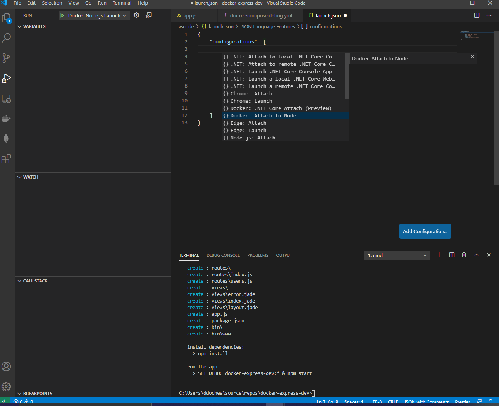
launch.json 편집

## 11. 디버그 옵션 변경

디버그 옵션을 이전 단계에서 선택한 `Docker: Attach to Node`로 바꿔주세요.

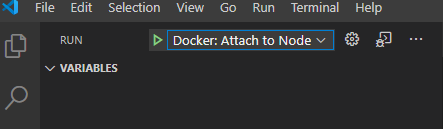
디버그옵션 변경

## 12. 디버깅 체크

breakpoint가 제대로 먹히는지 확인하기 위해 routers/index.js 파일 내 `res.render('index', { title: 'Express' });` 영역에 breakpoint를 설정하세요.
그 다음 `F5`키를 누르고, http://localhost:3000/ 에 접속하여 스크린샷과 같이 breakpoint가 잡히는지 확인해보세요.

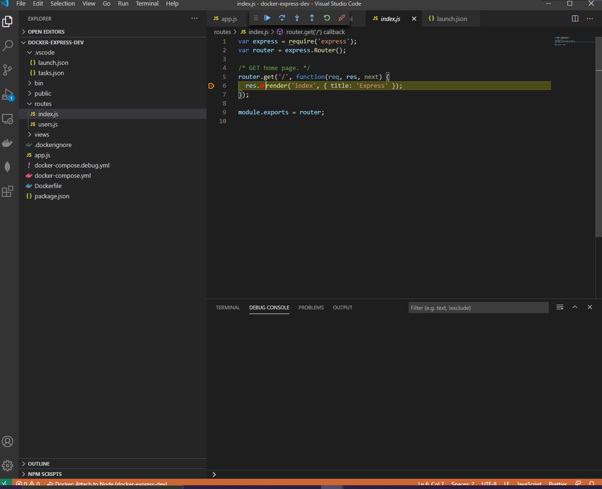
브레이크 포인트가 잡힌 모습

이것으로 손쉬운 docker 기반 개발환경 구축에 대해 알아보았습니다. 다른 언어들도 이와 비슷한 방법으로 구축 가능할 것이라 여겨집니다 😅